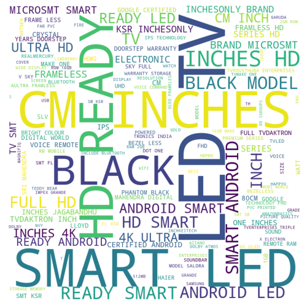
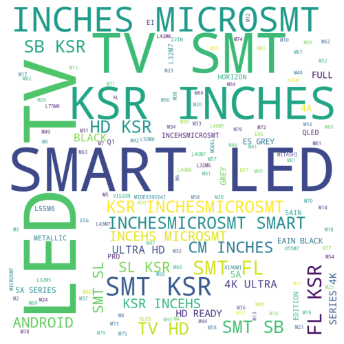
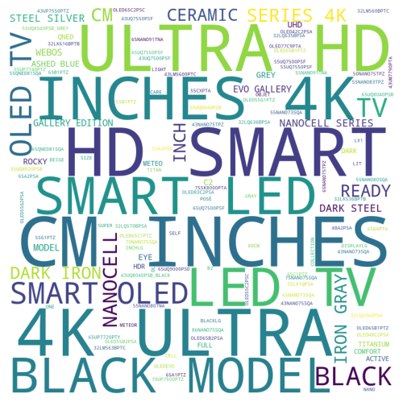
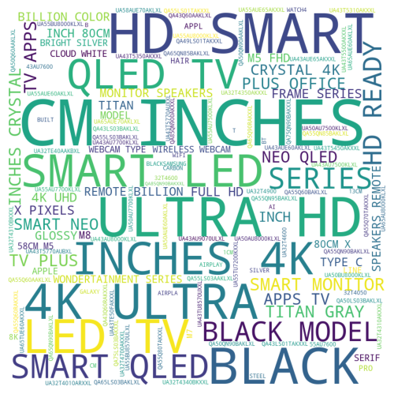
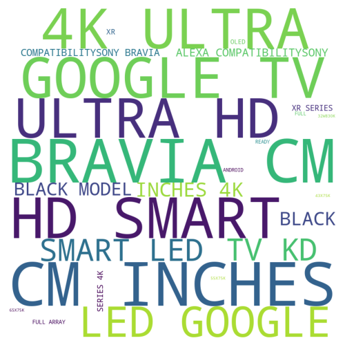
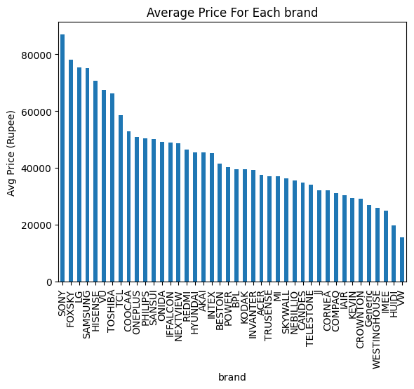
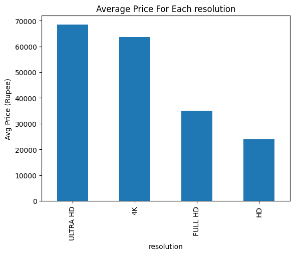
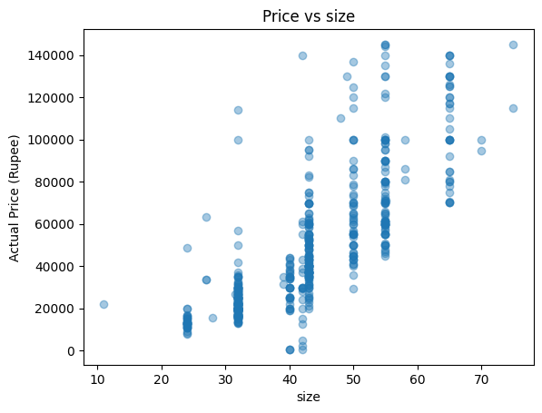
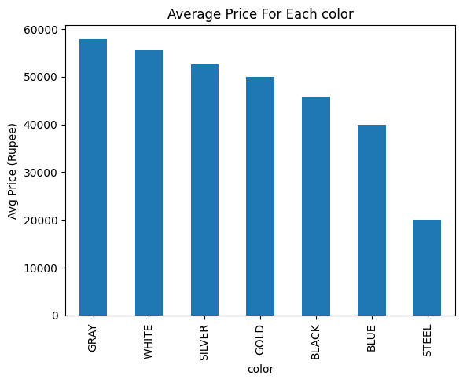
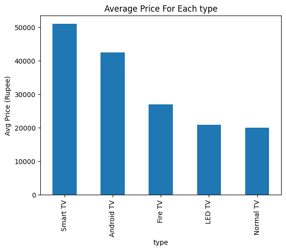

# Daria Machine Learning Task 


## Introduction
This project is designed to address several key machine learning tasks, including **data preprocessing**, **price prediction**, **similar product recommendation**, and **speech-to-text integration**. Each of these tasks is implemented as a sub-project, and together they form a comprehensive pipeline for analyzing and enhancing product-related data.

Here’s what the project covers:
1. [**Data Preprocessing**](#data-cleaning-and-feature-extraction): Cleaning and preparing the dataset for analysis.  
2. [**Price Prediction**](#price-prediction-modeling): Building a model to predict product prices based on features like category, description, and user reviews.
3. [**Similar Products**](#similarity-use-case): Identifying products that are similar to a given product using textual and categorical features.
4. [**Speech-to-Text Feature**](#speech-to-text-integration): Enabling users to describe products verbally, which is then transcribed and used to find similar products. 
5. [**Future Work**](#future-work)

---

## How to Use
To set up the project and run the code, follow these steps:

### 1. Create a Virtual Environment
It is recommended to use a virtual environment to manage dependencies. You can create one using the following commands:

```bash
# Create a virtual environment
python -m venv ml_project_env


# Activate the environment
# On Windows:
ml_project_env\Scripts\activate
# On macOS/Linux:
source ml_project_env/bin/activate
```

### 2. Install Required Packages
All required packages are listed in the requirements.txt file. Install them using pip:

```bash
pip install -r requirements.txt
```

### 3. Run the Code
Each sub-project (data preprocessing, price prediction, similar products, and speech-to-text) has its own script or notebook. Navigate to the respective folder and follow the instructions provided in the `README.md` or instructions within the notebook.


### Folder Structure
The project is organized into the following folder structure for clarity and ease of use:

```
daria_task/
│
├── data/                           # Contains datasets
│   ├── cleaned_tv_data.csv         # Cleaned television data
│   └── Televisions.csv             # Raw television data
│
├── notebooks/                      # Jupyter notebooks for different tasks
│   ├── 1_data_cleaning.ipynb       # Notebook for data cleaning
│   ├── 2_price_modeling.ipynb      # Notebook for price modeling
│   ├── 3_similarity_vectors.ipynb  # Notebook for similarity vectors
│   └── 4_speech_to_text.ipynb      # Notebook for speech-to-text integration
│
├── televisions_db/                 # Ready to used database-related files for televisions
│
├── voices/                         # Audio files for testing speech recognition system
│
├── .gitignore                      # Specifies files to ignore in version control
├── README.md                       # Project overview and instructions
└── utils.py                        # Utility functions for the project
```


## What is Data and How It is Selected

### Exploration of the Dataset
The dataset used in this project is sourced from the [Amazon Products Dataset](https://www.kaggle.com/datasets/lokeshparab/amazon-products-dataset) available on Kaggle. This dataset contains a wide range of products from Amazon, including details such as product names, categories, images, links, ratings, and prices. The dataset is comprehensive and provides a good foundation for various machine learning tasks.

### Selection of the Television Dataset
From the broader dataset, the **Television** subset was selected for the following reasons:
1. **Familiarity**: Televisions are a common and well-understood product category, making it easier to sanity-check the data and results.
2. **Ease of Analysis**: The television dataset aligns with the minimum requirements for this project, containing **1104 records**, which is sufficient for meaningful analysis and modeling.

### Dataset Features
The television dataset contains the following features:
- **name**: The name of the television product.
- **main_category**: The main category of the product (e.g., "tv, audio & cameras").
- **sub_category**: The sub-category of the product (e.g., "Televisions").
- **image**: A link to the product image.
- **link**: A link to the product page on Amazon.
- **ratings**: The average rating of the product (out of 5).
- **no_of_ratings**: The number of ratings the product has received.
- **discount_price**: The discounted price of the product.
- **actual_price**: The original price of the product.

### Sample Data
Below is a sample of the television dataset:

| name                                                                 | main_category       | sub_category | image                                                                 | link                                                                 | ratings | no_of_ratings | discount_price | actual_price |
|----------------------------------------------------------------------|---------------------|--------------|-----------------------------------------------------------------------|----------------------------------------------------------------------|---------|---------------|----------------|--------------|
| Samsung 80 cm (32 Inches) Wondertainment Series HD Ready LED TV      | tv, audio & cameras | Televisions  | [image_link](https://m.media-amazon.com/images/W/IMAGERENDE...)       | [product_link](https://www.amazon.in/Samsung-Inches-Wondertai...)    | 4.2     | 8,877         | ₹12,990        | ₹22,900      |
| MI 80 cm (32 inches) 5A Series HD Ready Smart Android TV             | tv, audio & cameras | Televisions  | [image_link](https://m.media-amazon.com/images/W/IMAGERENDE...)       | [product_link](https://www.amazon.in/MI-inches-Ready-Android-...)    | 4.2     | 34,286        | ₹13,999        | ₹24,999      |
| Redmi 80 cm (32 inches) Android 11 Series HD Ready LED TV            | tv, audio & cameras | Televisions  | [image_link](https://m.media-amazon.com/images/W/IMAGERENDE...)       | [product_link](https://www.amazon.in/Redmi-inches-Ready-L32M6...)    | 4.2     | 47,642        | ₹13,999        | ₹24,999      |
| OnePlus 138 cm (55 inches) Y Series 4K Ultra HD Smart Android LED TV | tv, audio & cameras | Televisions  | [image_link](https://m.media-amazon.com/images/W/IMAGERENDE...)       | [product_link](https://www.amazon.in/OnePlus-55-inches-Androi...)    | 4.2     | 8,290         | ₹38,999        | ₹49,999      |
| OnePlus 80 cm (32 inches) Y Series HD Ready LED Smart Android TV     | tv, audio & cameras | Televisions  | [image_link](https://m.media-amazon.com/images/W/IMAGERENDE...)       | [product_link](https://www.amazon.in/OnePlus-inches-Ready-And...)    | 4.2     | 36,800        | ₹14,999        | ₹19,999      |


### Limitations of the Dataset
While the dataset provides a solid foundation for tasks like price prediction and product similarity, it has some limitations:

1. **Limited Features**:  
   The dataset contains only basic features such as product names, categories, ratings, and prices. This restricts the ability to perform more advanced analyses, such as:
   - **Sentiment Analysis**: Requires user reviews or textual feedback, which are not available in this dataset.
   - **Purchase Value Prediction**: Requires historical purchase data or user behavior metrics, which are also absent.

2. **Null Values**:  
   The dataset contains some missing values in certain columns. These null values will be addressed in the [Data Cleaning and Feature Extraction](#data-cleaning-and-feature-extraction) section, where we will discuss methods for handling them, such as imputation or removal, depending on the context.


## Data Cleaning and Feature Extraction

### Features Extracted from the `name` Column
The `name` column in the dataset contains detailed information about each television product. To make this data more usable, the following features are extracted using regular expressions (regex):

1. **Non-English Characters**:  Check if the pruduct includes non-English characters, remove them from dataset.
   - **Regex Logic**: `[^\x00-\x7F”‘’–—\xa0®™°éèêëàâäôöûüΩ]`  
   - **Explanation**: This checks if the product name contains any non-English characters. If such characters are found, the product is flagged as containing non-English text and will be removed.

2. **Is TV**:  Not every product is a real tv. if is tv returns false, we remove the record.
   - **Regex Logic**:  
     - `(tv)`: Checks if the word "tv" is present in the name.  
     - `(?=.*\btv\b)(?=.*\b(box|stick)\b)`: Ensures the product is not a TV accessory like a "TV box" or "TV stick."  
     - `(?=.*\bfor\b)(?=.*\btv\b)`: Ensures the product is not an accessory "for TV."  
   - **Explanation**: These patterns verify whether the product is an actual television and not a TV-related accessory.

3. **Brand Name**:  It is tricky part. the best found method for finding brands is finding a list using repeated word and extract brand names manually and apply the regex rules. 
   - **Regex Logic**: `^(Samsung|MI|Redmi|OnePlus|...)`  
   - **Explanation**: Extracts the brand name from the product name by matching it against a predefined list of brands. If no brand is found, the product is labeled as "Generic."

4. **Size in Inches**:  
   - **Regex Logic**: `(\d+\.?\d*)\s*(inches|inch|-inch|-inches|"|”|incehs)`  
   - **Explanation**: Extracts the size of the TV in inches. It looks for numbers followed by terms like "inches," "inch," or symbols like `"` or `”`.

5. **Size in Centimeters**:  
   - **Regex Logic**: `(\d+\.?\d*)\s*(cm)`  
   - **Explanation**: Extracts the size of the TV in centimeters by looking for numbers followed by "cm."

6. **Resolution**:  
   - **Regex Logic**: `(4K|HD|Full HD|Ultra HD|HD Ready)`  
   - **Explanation**: Extracts the resolution of the TV, such as "4K," "HD," "Full HD," etc.

7. **Type**:  
   - **Regex Logic**: `(LED\s*TV|Smart\s*.*?\s*TV|Android\s*.*?\s*TV|QLED\s*TV|Fire\s*TV|Normal\s*TV)`  
   - **Explanation**: Extracts the type of TV, such as "LED TV," "Smart TV," "Android TV," etc. The type is further categorized based on keywords like "smart," "android," or "qled."

8. **Color**:  
   - **Regex Logic**: `(Black|Grey|Gray|Silver|Gold|White|Blue|Steel)`  
   - **Explanation**: Extracts the color of the TV from the product name. Colors like "Grey" are standardized to "Gray."

### Example of Extracted Features
For a product name like:  
`"Samsung 80 cm (32 Inches) Wondertainment Series HD Ready LED TV"`

The extracted features would be:
- **Non-English Characters**: `False`  
- **Is TV**: `True`  
- **Brand**: `SAMSUNG`  
- **Size in Inches**: `32 Inches`  
- **Size in Centimeters**: `80 cm`  
- **Resolution**: `HD Ready`  
- **Type**: `LED TV`  
- **Color**: `None`  


### WordClouds for Top Five Most Frequent Brands

To visualize the most common words in the product names for the top five brands, word clouds are generated. Word clouds provide a graphical representation of word frequency, where the size of each word indicates its frequency in the dataset.

   
   
   
   
   


## Price Prediction Modeling

### Preprocessing Steps
1. **Remove Records with Missing Prices**:  
   - Records with `NaN` values in the `price` column are removed.  
   - **Records Remaining**: 645 records.

2. **Remove Outliers Using IQR Method**:  
   - Outliers in the `price` column are removed using the Interquartile Range (IQR) method.  
   - **Records Remaining**: 585 records.

3. **Impute Missing Values**:  
   - For **size-related features**: Missing values are imputed using the **KNN Imputer**.  
   - For **categorical features**: Missing values are imputed using the **mode** (most frequent value).

4. **Feature Relations with Price**:  
   - Below are the visualizations showing the relationship between features and the target variable (`price`):   

     
     
     
     
     

---

### Modeling Steps
1. **One-Hot Encoding**:  
   - Categorical features (e.g., `brand`, `type`, `resolution`) are encoded using **one-hot encoding** to convert them into numerical format.

2. **Standard Scaling**:  
   - Numerical features (e.g., `size`) are scaled using **StandardScaler** to normalize the data.

3. **Model Selection**:  
   - **Baseline Model**: A simple baseline model is used to establish a performance benchmark.  
   - **Ensemble Model**: A **Random Forest** model is selected for its robustness and ability to handle non-linear relationships.  
   - **Hyperparameter Tuning**: Randomized search with **50 iterations** is performed to find the best hyperparameters for the Random Forest model.

4. **Train-Test Split**:  
   - The dataset is split into **80% training** and **20% testing** sets to evaluate the model's performance.

5. **Evaluation Metrics**:  
   - **Mean Absolute Error (MAE)**: 8357 Rupees  
     - This metric indicates the average absolute difference between predicted and actual prices.  
   - **Mean Absolute Percentage Error (MAPE)**: 19.2%  
     - This metric provides the average percentage error in predictions relative to the actual prices.


## Similarity Use Case

### Idea
The goal of this use case is to find products similar to a given query based on their names. This is achieved by:
1. **Vectorizing Product Names**: Converting product names into numerical vectors (embeddings) using a pre-trained sentence transformer model.
2. **Querying Similar Products**: Using the vectorized embeddings to find products that are semantically similar to the query.

---

### Vectorization
For vectorizing product names, the **`sentence-transformers/paraphrase-MiniLM-L6-v2`** model is used. This model is chosen because it offers:
- **Good Accuracy**: It captures semantic meaning effectively.
- **High Speed**: It is optimized for fast inference, making it suitable for real-time applications.

The model converts each product name into a 384-dimensional vector, which is then used for similarity comparisons.

---

### Sample Query and Results
Below is an example of how the similarity search works:

#### Sample Query:
```python
query = "samsung 42 inch ultra"
```

#### Output:
```python
[
    "Samsung 43 Inch Ultra HD Smart TV",
    "Samsung 42 Inch LED Ultra HD TV",
    "Samsung 40 Inch Full HD Smart TV",
    "Samsung 42 Inch 4K Ultra HD TV",
    "Samsung 42 Inch Smart LED TV"
]
```

## Speech-to-Text Integration

### Overview
This section describes the integration of speech-to-text functionality to enable users to search for products using voice input. The process involves:
1. **Loading Recorded Voices**: Capturing or loading audio files containing user voice input.
2. **Converting Speech to Text**: Using the **Google Speech-to-Text API** to transcribe the audio into text.
3. **Encoding the Text**: Converting the transcribed text into embeddings using the same embedding model (`sentence-transformers/paraphrase-MiniLM-L6-v2`) used for product names.
4. **Finding Similar Products**: Querying the vector database to retrieve products similar to the transcribed text.

---

### Steps for Speech-to-Text Integration

1. **Load Recorded Voices**:  
   Audio files containing user voice input are loaded into the system.

2. **Integrate Google Speech-to-Text API**:  
   The **Google Speech-to-Text API** is used to convert the audio into text. This API is chosen for its high accuracy and support for multiple languages.

3. **Encode Using the Embedding Model**:
The transcribed text is encoded into a 384-dimensional vector using the paraphrase-MiniLM-L6-v2 model.


4. **Look for Similar Products**:
The encoded text is used to query the vector database and retrieve similar products.


### Sample Input and Output
Input:

Voice Text: "LG 42 inch smart tv"

Predicted Text: "Angie 42 inch Smart TV" (transcribed by the Google API)

Output:
Retrieved Samples:
```python
[
    "43 INCH Smart TV",
    "32 INCH Smart TV",
    "INVANTER 2022 Model Smart TV 32 INCH Frameless-Smart Tv",
    "INVANTER 2022 Model Smart TV FRAMLESS Android 43 INCH-SR 2 E",
    "INVANTER 2022 Model Smart TV 43 INCH Frameless"
]
```

## LLM Helps List

The Large Language Model (LLM) provided significant assistance in the following areas:

1. **Documentation and README File**:  
   - The LLM was instrumental in creating well-structured and detailed documentation, including the README file. It helped in organizing content, writing clear explanations, and ensuring the documentation is user-friendly.

2. **Creating Regex Patterns**:  
   - The LLM assisted in designing and refining regular expressions (regex) for tasks such as:
     - Extracting brand names, sizes, resolutions, and other features from product names.
     - Cleaning and preprocessing text data.
   - Its ability to understand and generate complex regex patterns saved time and improved accuracy.

## Future Work

While the current implementation provides a solid foundation, there are several areas for improvement and advanced techniques that can be explored to enhance the project:

1. **Basic Approach Limitations**:  
   - The current implementation is a basic approach, developed within 1-2 days of work. While it meets the minimum requirements, there is significant room for improvement in terms of accuracy, scalability, and feature richness.

2. **Ideas for Boosting Performance**:  
   - **Advanced Brand Name Extraction**:  
     Use **Named Entity Recognition (NER)** models to more accurately identify and extract brand names from product descriptions. This can improve the precision of brand-related features.
   - **Crawling for Missing Values**:  
     Implement web crawling techniques to fill missing values (e.g., prices, ratings) by scraping additional data from e-commerce websites or other reliable sources.
   - **Image Classification for Product Verification**:  
     Develop an **image classification system** to verify whether a product is a real TV by analyzing product images. This can help filter out non-TV products or accessories.
   - **Sentiment Analysis Using Reviews**:  
     Collect and analyze **user review data** to perform sentiment analysis. This can provide insights into product quality and customer satisfaction, which can be used to enhance recommendations.
   - **Advanced Modeling Techniques**:  
     Replace the current **Random Forest** model with more complex models such as:
     - **Gradient Boosting Machines (e.g., XGBoost, LightGBM, CatBoost)**
     - **Deep Learning Models (e.g., Neural Networks)**
     - **Transformer-based Models (e.g., BERT for regression tasks)**

3. **Scalability and Deployment**:  
   - **API Development**: Create an API to allow seamless integration with other applications or services.

